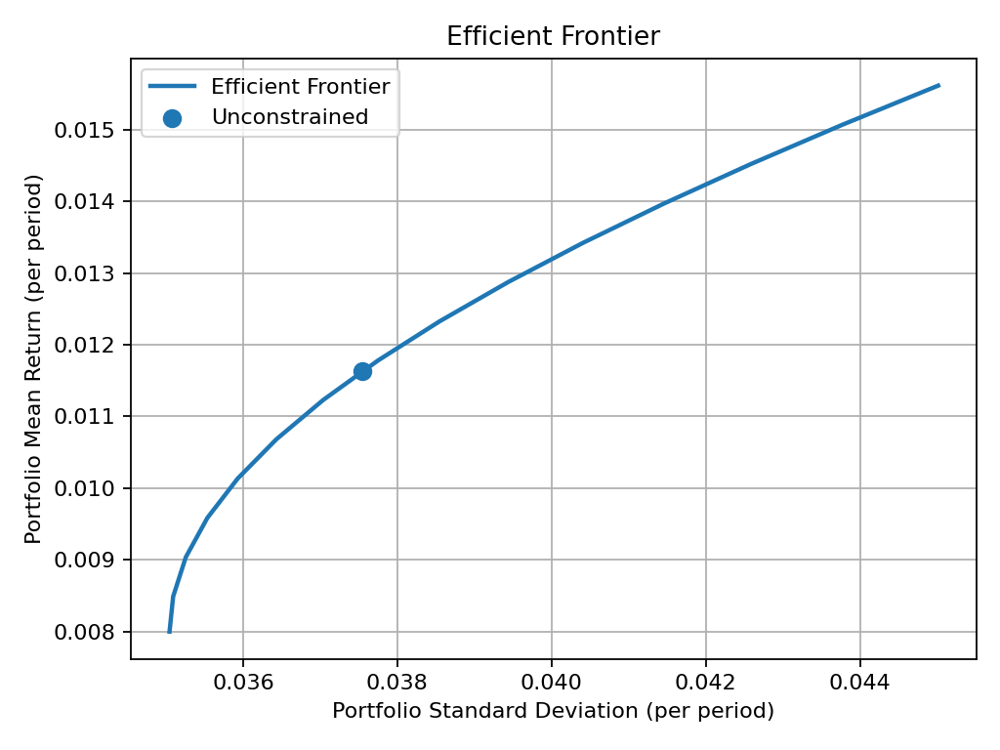
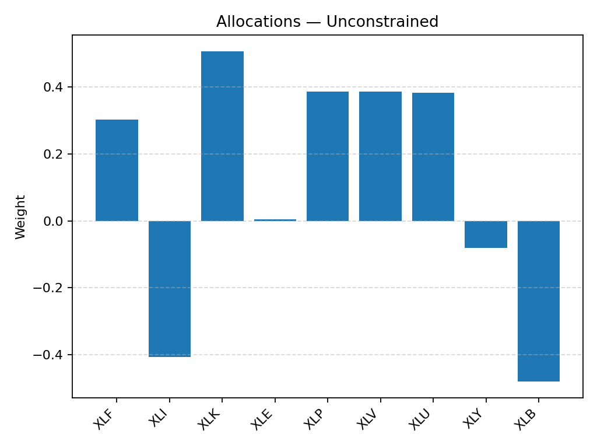

# Project Title: Portfolio Optimization Toolkit

## Overview

This project demonstrates convex optimization–based portfolio allocation with practical financial constraints. It uses `cvxpy` to implement mean-variance optimization, regularization penalties, and turnover limits, then compares unconstrained vs. constrained allocations. The toolkit works with live market data (via `yfinance`) or reproducible synthetic returns. It produces CSV results and PNG plots for efficient frontiers and allocations.

## Key Features

* Downloads historical prices for S&P 500 sector ETFs (or simulates synthetic returns for reproducibility).
* Estimates expected returns and covariance matrices.
* Implements mean-variance optimization:
  * **Unconstrained Markowitz** baseline.
  * **Constrained optimization** with:
    - **L1 penalty** → promotes sparse portfolios.
    -  **L2 penalty** → improves stability.
    -  **Turnover constraint** is expressed as $\|w_t - w_{t-1}\| \leq \tau$
    -  **Long-only & budget constraints** are given by $w \geq 0$ and $\sum w = 1$.


* Generates and saves:
  * **Efficient frontier plots** (risk vs. return).
  * **Asset allocation bar charts**.
  * **CSV files** for returns, weights, and frontier data.

## Example Output

```

\=== Data ===
Assets: XLF, XLI, XLK, XLE, XLP, XLV, XLU, XLY, XLB
Samples: 120 monthly observations

\=== Solutions ===
Unconstrained:
mean=0.011629 per period, stdev=0.037545, var=0.001410
sparsity (nonzeros): 9/9

```






## Skills Demonstrated

* Convex optimization (Markowitz mean-variance, L1/L2 penalties, turnover constraints)
* Finance applications of optimization (portfolio construction, risk-return tradeoffs)
* Python tooling (`cvxpy`, `numpy`, `pandas`, `matplotlib`)
* Data engineering (fetching market data, synthetic simulation for reproducibility)
* Visualization of risk-return profiles and portfolio weights

## How to Run

Install dependencies:

```

pip install numpy pandas matplotlib cvxpy scipy yfinance

```

Run baseline unconstrained optimization:

```

python portfolio_optimization.py --plot

```

Run with constraints (L1/L2 regularization, long-only, turnover limit, compare vs. unconstrained):

```

python portfolio_optimization.py
--l1 0.02 --l2 0.10 --long_only --turnover_tau 0.10
--w_prev_csv outputs/weights_unconstrained.csv
--compare --plot
```

Force synthetic data (reproducible run, no internet required):

```

python portfolio_optimization.py --no_internet --freq monthly --compare --plot

```

